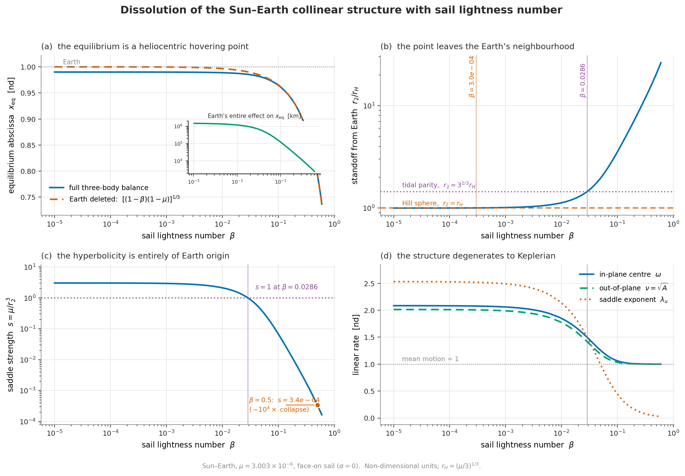

<div align="center">

# ☀️ Solar Sail CR3BP

### Dissolution of the Collinear Structure at Finite Sail Lightness Number

*When does a solar sail stop having a Lagrange point? A computational study in the Sun–Earth and Earth–Moon circular restricted three-body problems.*

[](https://python.org)
[](https://numpy.org)
[](https://scipy.org)
[](https://matplotlib.org)
[](https://iisc.ac.in)

**Bishwaswarup** · Indian Institute of Science, Bangalore
</div>

---

## The Result

A face-on solar sail does not *displace* the collinear Lagrange point. It **dissolves** it.

Because a face-on sail (α = 0) produces a purely radial, conservative force, it simply rescales solar gravity, (1−μ) → (1−β)(1−μ). The on-axis equilibrium is therefore the root of a Kepler-like balance, and with the Earth **deleted entirely** it sits at

$$x_{\rm hover}(\beta) = \left[(1-\beta)(1-\mu)\right]^{1/3}$$

This is a *heliocentric hovering point* — the radius where reduced solar gravity balances centrifugal acceleration at the synchronous rate. It is not a perturbation of L₁.

The whole content of the study is the rate at which the collinear structure degenerates into this hovering point as β grows. Defining the **saddle strength**

$$s(\beta) = \mu / r_2^3, \qquad A(\beta) = \tfrac{(1-\beta)(1-\mu)}{r_1^{3}} + \tfrac{\mu}{r_2^{3}} = 1 + s$$

(a real hyperbolic pair requires A > 1, so *all* hyperbolicity is of Earth origin), we find two thresholds:

| Criterion | Condition | β_crit | Standoff |
|---|---|---|---|
| **Hill-sphere exit** | r₂ = r_H = (μ/3)^(1/3) | **2.98 × 10⁻⁴** | 1.00 r_H |
| **Tidal parity** | s = 1, i.e. r₂ = μ^(1/3) | **0.02865** | 3^(1/3) r_H = 1.442 r_H |

The tidal-parity threshold has an exact closed form, **r₂ = μ^(1/3) = 3^(1/3) r_H**, and for the Sun–Earth system it lands at **β ≈ 0.0286 — inside the range of present-day sail technology (β ~ 0.01–0.05).** Existing sails already sit at the boundary where the Sun–Earth collinear structure ceases to be dynamically meaningful. That is the publishable statement.

<div align="center"></div>

*Panel (a): the full three-body equilibrium is indistinguishable from the Earth-free hovering law; the inset shows the Earth's entire contribution collapsing to a few thousand km. (b) the standoff crosses the Hill sphere almost immediately and reaches 20.6 r_H at β = 0.5. (c) the saddle strength collapses four orders of magnitude. (d) the in-plane and out-of-plane frequencies both converge on the mean motion — the Keplerian epicyclic degeneracy.*

---

## What β = 0.5 Actually Is

The β = 0.5 case, run in `main.py`, is **past** both thresholds by a wide margin. Its results are artifacts of the hovering geometry, not dynamical findings:

| Reported | Reality |
|---|---|
| "L₁ displaced sunward by 29.4 M km" | A heliocentric hovering point at 0.7937 AU. The Earth's **entire** contribution is 2.55 × 10⁻⁵ nd = **3,817 km**, against a 30.9 M km standoff — **20.6 Hill radii**, where the Earth is dynamically irrelevant. |
| "One-year period — resonance with Earth" | **Forced, not resonant.** In a 1/r² field the epicyclic frequency equals the mean motion identically. As A → 1 the planar roots become λ² = {−1, 0} and ν = √A → 1, so the period is pinned to exactly 2π nd. Verified: ω = 1.00042656, ν = 1.00021348. |
| "λ_u = 1.25 — the sail stabilised the orbit" | **No saddle was tamed; the orbit moved away from one.** The linear saddle exponent at the point is λ = 0.035781 nd, and exp(0.035781 × 6.281845) = **1.25203** — reproducing the reported monodromy eigenvalue 1.252011 to five figures. The residual is *entirely* the Earth's leftover tug: s(0.5) = 3.42 × 10⁻⁴. |
| "L₁→L₂ transfer for 0.05 m/s" | **Self-matching.** `main.py` builds *both* manifolds from the same `state0_class`. W^u and W^s of one orbit both contain that orbit, so the matcher returns its self-intersection: the two "matched" states are the same point (separation 0.000 km), each 137.9 km from the halo — the ε = 150 km seed perturbation. There is no second orbit and no transfer. |

Note that the saddle never strictly vanishes: A = 1 + s with s > 0 always, so there is no bifurcation — only a smooth, four-decade degeneration. Reporting the *collapse rate* is both more honest and more interesting than claiming a stability transition.

---

## Earth–Moon Heteroclinic Connections

The earlier claim — matched Jacobi constants at Az = 0.02 for both halos, ΔC = 5.7 × 10⁻⁵ — does not survive. Two independent problems:

**1. Equal Az does not give equal C.** The L₁ and L₂ families have different energy-vs-amplitude slopes. There is no reason for them to coincide, and they do not.

**2. The corrector was branch-hopping.** `compute_halo_orbit`'s free variables are `[x₀, vy₀, T_half]` with constraints `[vx_f, vz_f, y_f] = 0`. **z₀ is never a free variable and Az is never a constraint** — Az only seeds the Richardson guess. Calling it independently at each Az lands on different branches:

```
 Az     C(L2)  unseeded        C(L2)  continued        T
0.005   3.17207607             3.15200518          3.41532
0.010   3.15127516  ← jump     3.15167618          3.41471
0.020   3.17087868  ← jump     3.14870567          3.40910
0.040   3.13757644  ← jump     3.13757644          3.38692
```

The apparent match at Az = 0.02 was a **spurious orbit** (T = 3.5195 against the true family's 3.4091). Corrected:

| At Az = 0.02 | old | corrected |
|---|---|---|
| C_L1 | 3.17093543 | 3.17093543 |
| C_L2 | 3.17087868 | **3.14870567** |
| **ΔC** | 5.7 × 10⁻⁵ | **2.2 × 10⁻²** |

`src/jacobi_match.py` fixes this with natural-parameter continuation (each solution seeds the next, with z₀ overwritten to step Az explicitly) plus a period-continuity branch guard. Both families then track smoothly and monotonically, and **genuine energy-matched pairs require very unequal amplitudes**:

```
  C_target      Az_L1      Az_L2    ratio      T_L1      T_L2
------------------------------------------------------------------
3.14165258    0.06446    0.04949      1.3   2.76710   3.39527
3.14369698    0.06225    0.04427      1.4   2.76574   3.39936
3.14574137    0.05997    0.03842      1.6   2.76436   3.40338
3.14778577    0.05763    0.03158      1.8   2.76295   3.40734
3.14983017    0.05522    0.02288      2.4   2.76153   3.41124
3.15187456    0.05272    0.00740      7.1   2.76008   3.41508
```

L₁ family C ∈ [3.13128, 3.17349] over Az ∈ [0.010, 0.075]; L₂ family C ∈ [3.14144, 3.15209] over Az ∈ [0.0025, 0.050]. **Overlap: C ∈ [3.14144, 3.15209].** The most balanced pair is C ≈ 3.1417 with Az_L1 = 0.0645, Az_L2 = 0.0495.

### On the 544 m/s figure

A genuine heteroclinic connection costs **zero ΔV by construction** — the unstable manifold of one orbit *is* the stable manifold of the other. 544 m/s with a 57 km residual is therefore not a heteroclinic connection and must not be described as "low-cost ballistic-like." It is at best a **manifold-guided two-impulse transfer**.

Worse, it was computed at Az = 0.02 for both halos, so its L₂ endpoint was the spurious orbit above. **`fig6_poincare_map.png` and `fig7_manifold_transfer.png` are invalidated and must be regenerated** at a matched pair from the table, with the self-intersection guard now available in `match_manifolds(..., exclude_states=..., min_sep=...)`. This is the top open item.

---

## Sail Force Model

The implementation in `src/dynamics.py` is a correct **ideal specular reflector**:

$$\mathbf{a}_{\rm sail} = \beta \frac{1-\mu}{r_1^{2}} \cos^{2}\!\alpha \; \hat{\mathbf{n}}, \qquad \hat{\mathbf{n}} = \cos\alpha\,\hat{\mathbf{r}} + \sin\alpha\cos\delta\,\hat{\mathbf{t}} + \sin\alpha\sin\delta\,\hat{\mathbf{k}}$$

Force purely along the sail normal, magnitude ∝ cos²α. An earlier draft of this README wrote the bracketed form `cos α · [cos α n̂ + sin α t̂]`, which is the **perfect absorber** (force along the sun-line, magnitude ∝ cos α). The two agree only at α = 0. The code was always right; the documentation was wrong. Figures 4 and 5, which depend on off-axis behaviour, are unaffected.

| Parameter | Symbol | Meaning |
|---|---|---|
| Cone angle | α | Sun-line to sail normal. α = 0 → face-on (max thrust); α = π/2 → edge-on |
| Clock angle | δ | Azimuth of the normal about the sun-line |
| Lightness number | β | SRP force / solar gravity. β ~ 0.01–0.05 current; β = 0.5 far-future |

Membrane billow, finite slew rate and self-shadowing are not modelled; see Dachwald et al. on why non-ideal optics matter more than that estimate suggests.

---

## Figures

<div align="center">


</div>

**Figure 1 — β family of orbits.** The computation is sound; the interpretation is the dissolution above, not a family of displaced halos.

<div align="center"></div>

**Figure 2 — Eigenvalue map.** The unstable eigenvalue collapses toward unity because the standoff grows and the Earth's tidal term dies, not because the sail stabilises a saddle.

<div align="center"></div>

**Figure 3 — Floquet exponents.** Out-of-plane mode decouples and stays neutrally stable; both frequencies converge on the mean motion.

<div align="center"></div>

**Figure 4 — Reachable acceleration set vs β.** Ideal-reflector off-axis behaviour, cos²α along the normal.

<div align="center"></div>

**Figure 5 — Station-keeping suite.** Minimum β for LQR stability, control-authority map, closed-loop LQR simulation, and the sensitivity-matrix corrector. Valid as controller demonstrations; the β = 0.5 nominal should be read as a hovering point.

<div align="center">
 
 
</div>

**Figures 6–7 — Earth–Moon manifolds. ⚠️ Invalidated, pending regeneration** (see above).

<div align="center">
 
</div>

---

## Positioning Against the Literature

Artificial equilibria, sail halo orbits and sail station-keeping are all well-established. This work must be positioned against, not presented as independent of:

1. **McInnes, C. R.** (1999). *Solar Sailing: Technology, Dynamics and Mission Applications*. Springer–Praxis. — The standard reference.
2. **McInnes, C. R., McDonald, A. J., Simmons, J. F. L., MacDonald, E. W.** (1994). "Solar sail parking in restricted three-body systems." *J. Guidance, Control, and Dynamics* **17**(2), 399–406. [doi:10.2514/3.21211](https://arc.aiaa.org/doi/10.2514/3.21211) — Surfaces of artificial equilibria; the direct antecedent of the equilibrium calculation here.
3. **Baoyin, H. & McInnes, C. R.** (2006). "Solar sail halo orbits at the Sun–Earth artificial L₁ point." *Celestial Mechanics and Dynamical Astronomy* **94**(2), 155–171. [doi:10.1007/s10569-005-4626-3](https://link.springer.com/article/10.1007/s10569-005-4626-3) — Precisely the orbits of Figures 1–3.
4. **Waters, T. J. & McInnes, C. R.** (2007). "Periodic orbits above the ecliptic in the solar-sail restricted three-body problem." *J. Guidance, Control, and Dynamics* **30**(3), 687–693. [doi:10.2514/1.26232](https://arc.aiaa.org/doi/10.2514/1.26232)
5. **Farrés, A. & Jorba, À.** (2010). "Periodic and quasi-periodic motions of a solar sail close to SL₁ in the Earth–Sun system." *Celestial Mechanics and Dynamical Astronomy* **107**, 233–253. [doi:10.1007/s10569-010-9268-4](https://link.springer.com/article/10.1007/s10569-010-9268-4) — Station-keeping at SL₁; must be cited before any station-keeping claim.
6. **Farrés, A. & Jorba, À.** (2016). "Station keeping strategies for a solar sail in the solar system." [doi:10.1007/978-3-319-27464-5_3](https://link.springer.com/chapter/10.1007/978-3-319-27464-5_3)
7. **Dachwald, B. et al.** (2013). "Solar sails are not ideal, and yes it matters." [doi:10.1007/978-3-642-34907-2_55](https://link.springer.com/chapter/10.1007/978-3-642-34907-2_55) — On the non-ideal optics caveat.
8. **Heiligers, J. & McInnes, C. R.** "Solar sail Lyapunov and halo orbits in the Earth–Moon three-body problem." [eprints.gla.ac.uk/110808](https://eprints.gla.ac.uk/110808/1/110808.pdf) — Relevant to Figures 6–7.

**The novel contribution, as far as these establish, is the dissolution criterion itself**: the closed-form tidal-parity threshold r₂ = μ^(1/3) = 3^(1/3) r_H, and the observation that it falls inside current sail performance. That claim needs a literature check before submission.

---

## Repository Layout

```
SOLAR_SAIL/
├── main.py                     End-to-end pipeline (β = 0.5 case; see caveats above)
├── src/
│   ├── dynamics.py             CR3BP EOM + ideal-reflector sail acceleration
│   ├── equilibria.py           Newton solver for artificial equilibria
│   ├── orbits.py               Richardson guess + 3-variable corrector
│   ├── manifolds.py            Monodromy, Floquet vectors, manifold propagation
│   ├── transfer.py             Poincaré sections, matching (now with self-intersection guard)
│   ├── critical_beta.py     ★  NEW — dissolution analysis, thresholds, Figure 8
│   ├── jacobi_match.py      ★  NEW — family continuation + true energy matching
│   ├── sail_control.py         Reachable set, sensitivity-matrix corrector
│   ├── stationkeeping.py       LQR controller, minimum-β sweep
│   ├── heteroclinic.py         Earth–Moon manifolds (needs rerun at a matched pair)
│   ├── paper_extras.py         Figure generators (CLI)
│   ├── animations.py           GIF / MP4 generation
│   └── viz.py                  Plotting utilities
├── verify_critique.py       ★  Standalone re-derivation of every claim above
├── verify_transfer.py       ★  Self-matching and Jacobi-matching checks
└── fig1–fig8, *.gif, *.mp4, results.txt
```

---

## Getting Started

```bash
python -m venv .venv && source .venv/bin/activate
pip install numpy scipy matplotlib

python -m src.critical_beta        # thresholds + Figure 8   (the headline result)
python -m src.jacobi_match         # family continuation + matched pairs
python verify_critique.py          # independent re-derivation of all claims
python verify_transfer.py          # self-matching + Jacobi checks

python main.py                     # full β = 0.5 pipeline (read caveats first)
python -m src.paper_extras all     # figures 1–4
python -m src.paper_extras fig5sk  # station-keeping
```

---

## Open Items

1. **Regenerate Figures 6–7** at an energy-matched pair (C ≈ 3.1417, Az_L1 = 0.0645, Az_L2 = 0.0495), using `min_sep` to exclude self-intersections. Report the result as a manifold-guided two-impulse transfer with an honest ΔV, or drive the matching to convergence for a true connection.
2. **Constrain Az in the corrector.** Add z₀ as a free variable with an amplitude constraint so Az is enforced rather than merely guessed. This is the root cause of the branch-hopping.
3. **Literature check on the dissolution criterion** — confirm the r₂ = μ^(1/3) threshold is not already in McInnes (1994) or Farrés & Jorba.
4. **Reframe the manuscript** around the dissolution result rather than "the orbit became stable."

---

<div align="center">
<sub>Bishwaswarup · Indian Institute of Science, Bangalore </sub>
</div>
