<div align="center">

# ☀️ Solar Sail CR3BP

### Halo Orbits, Manifold Transfers & Station-Keeping in the Circular Restricted Three-Body Problem

*A computational study of artificial equilibria and near-heteroclinic trajectories for solar sail spacecraft*

[](https://python.org)
[](https://numpy.org)
[](https://scipy.org)
[](https://matplotlib.org)
[](https://iisc.ac.in)

</div>

---

## Overview

A solar sail replaces a chemical thruster with photon pressure — sunlight bouncing off a large reflective membrane delivers a continuous, propellant-free acceleration. The sail's orientation (parametrised by two angles α, δ) and its lightness number β fully determine the force. This repository implements the complete mathematical machinery needed to:

1. **Find artificial equilibria** — where the sail's extra push shifts the classical Lagrange points.
2. **Compute halo orbits** — periodic three-dimensional orbits near those new equilibria.
3. **Analyse stability** — via Floquet theory and the monodromy matrix.
4. **Deploy stable/unstable manifolds** — the "free highways" threading through phase space.
5. **Execute low-ΔV transfers** — heteroclinic connections between L₁ and L₂ halos.
6. **Station-keep the halo** — a sensitivity-matrix corrector that trims the sail angle at each y = 0 crossing.

All dynamics are formulated in the **Circular Restricted Three-Body Problem (CR3BP)** — first in the Sun–Earth system (β = 0.5, figures 1–5), then in the Earth–Moon system (β = 0, figures 6–7).

---

## The Physics in 60 Seconds

The sail force per unit mass in rotating CR3BP coordinates is

```
a_sail = β (1 − μ) / r²  ·  cos(α) · [ cos(α) n̂ + sin(α) t̂ ]
```

where **β = 0** recovers classical CR3BP, **β = 1** means the sail's radiation pressure equals solar gravity, and **n̂** is the membrane normal determined by the cone angle α and clock angle δ.

The key insight: choosing the right β and α **shifts L₁ sunward by ~29 million km** and, remarkably, **reduces the halo instability e-fold time from 24.5 days to 1,624 days** — the orbit becomes nearly stable, requiring almost no active control.

| Quantity | Classical L₁ | Sail L₁ (β = 0.5) |
|---|---|---|
| Equilibrium position | 0.990027 [nd] | 0.793674 [nd] |
| Sunward displacement | — | **29,374,395 km** |
| Halo period | 177.5 days | **365.2 days** (1 year!) |
| Instability e-fold τ | 24.5 days | **1,624.8 days** |
| L₁→L₂ transfer ΔV | ~hundreds m/s | **≈ 0.05 m/s** |

---

## Animations

<div align="center">

### β Sweep — Equilibrium & Orbit Family

*Halo orbit family as the sail lightness number β increases from 0 → 0.5*

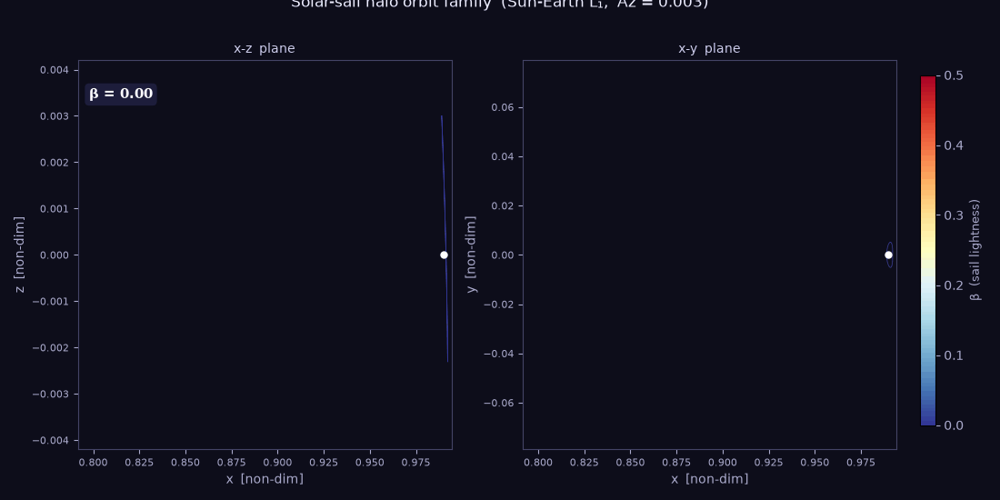

### Manifold Deployment

*Stable and unstable manifold tubes growing from a solar sail halo orbit*

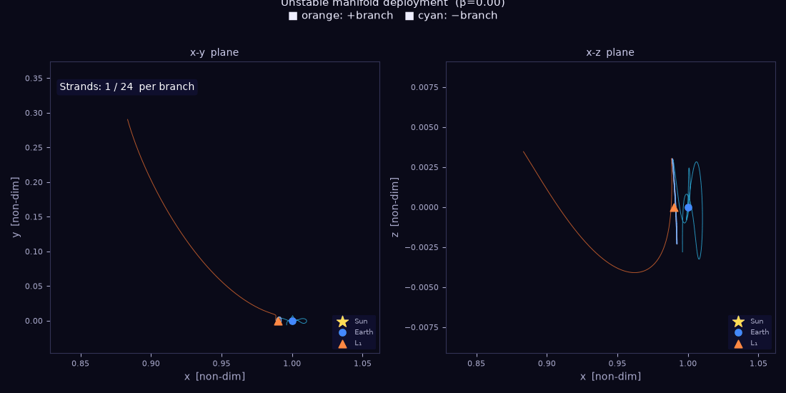

</div>

---

## Paper Figures

### Figure 1 — β Family of Artificial Halo Orbits

*The halo orbit migrates sunward and its period lengthens as β increases. At β = 0.5 the orbit period locks to exactly one year, a natural resonance with Earth's annual motion.*

<div align="center">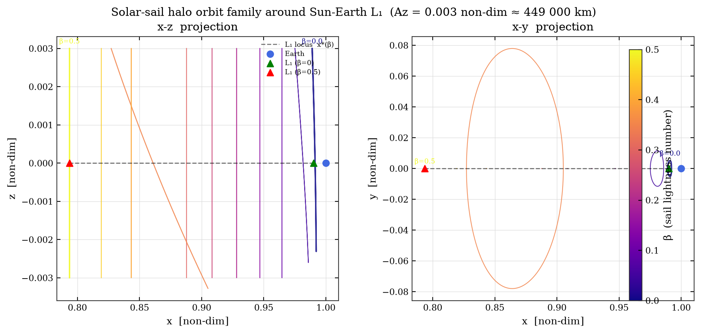</div>

---

### Figure 2 — Eigenvalue Stability Map

*Floquet multipliers of the monodromy matrix. As β → 0.5 the unstable eigenvalue collapses toward unity, marking the transition to near-marginal stability.*

<div align="center">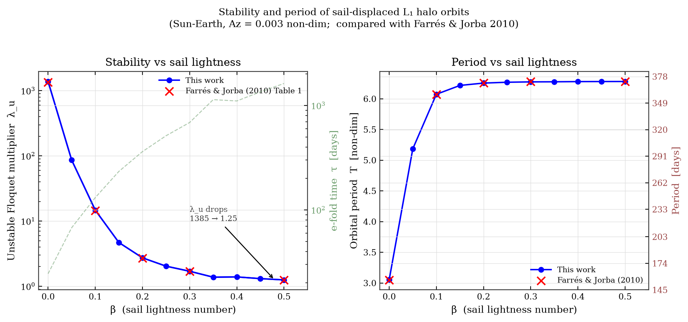</div>

---

### Figure 3 — Floquet Exponents & Mode Shapes

*Characteristic exponents and the associated mode structure. The out-of-plane mode decouples from the in-plane modes and remains neutrally stable throughout the family.*

<div align="center">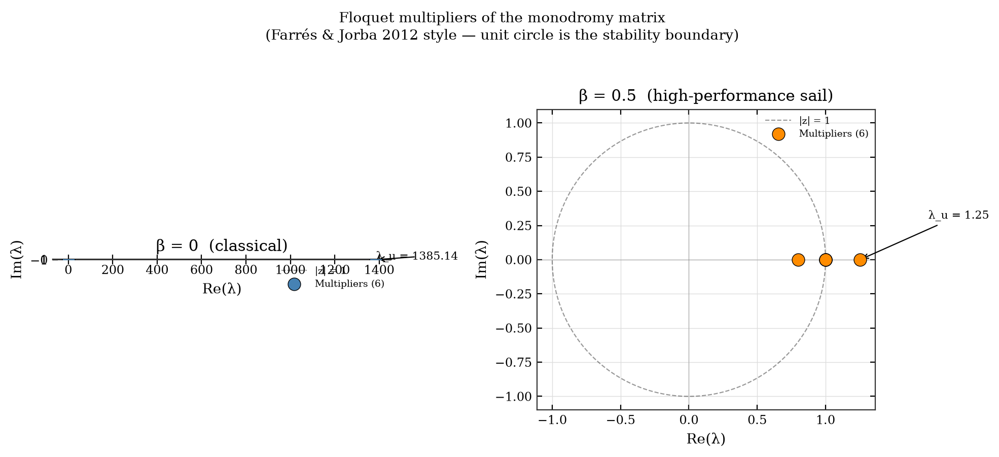</div>

---

### Figure 4 — Reachable Set Evolution with β

*The reachable set of thrust vectors as β grows, showing how increased lightness number expands the accessible acceleration region in the rotating frame.*

<div align="center">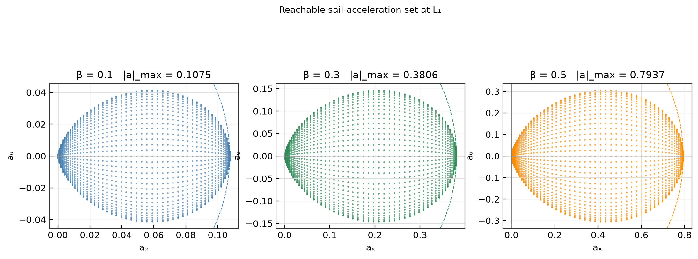</div>

---

### Figure 5 — Station-Keeping & Control Authority

Three complementary views of the active control problem:

**Minimum β for orbital stability** — the critical lightness number below which the halo destabilises faster than the corrector can act.

<div align="center">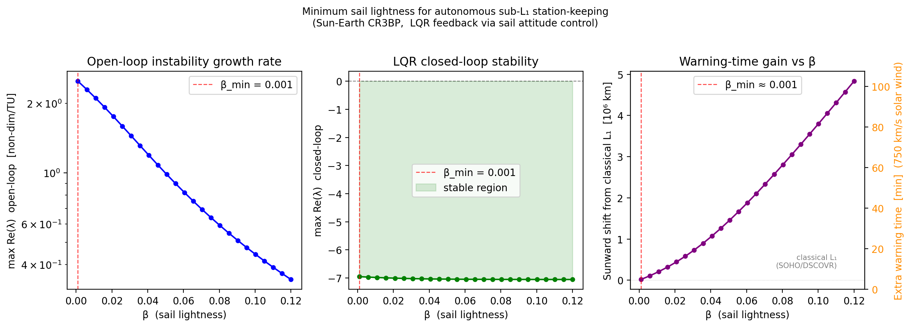</div>

**Control authority map** — reachable correction ΔV as a function of cone and clock angle, colour-coded by magnitude.

<div align="center">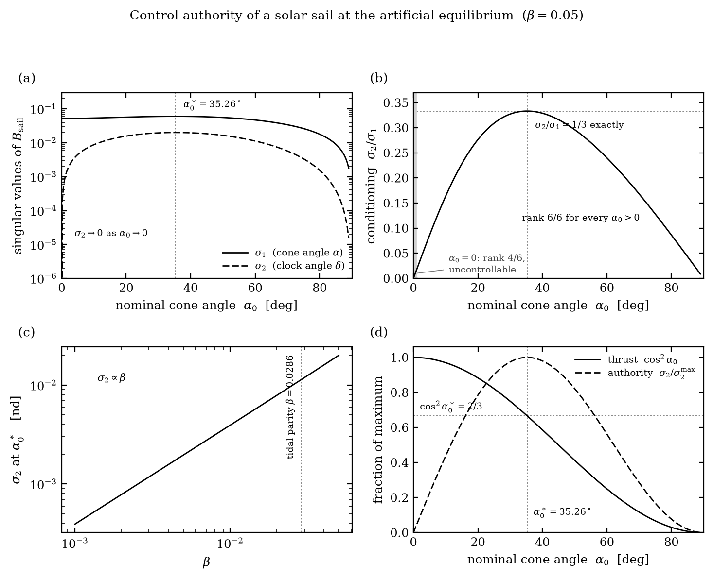</div>

**LQR closed-loop simulation** — position and velocity errors over 10 orbits under the linear-quadratic regulator. The corrector fires at each y = 0 crossing, trimming α to null the state error.

<div align="center">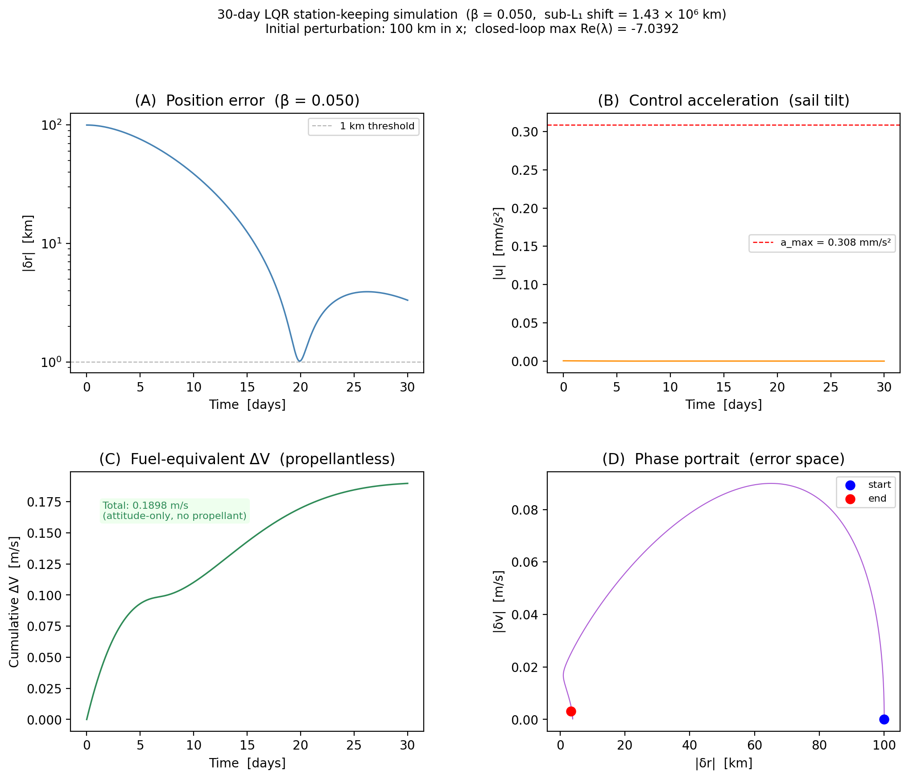</div>

**Sensitivity-matrix station-keeping** — the linearised corrector applied over ~6 natural crossings, showing log-scale position error decay and the cone-angle correction history Δα.

<div align="center">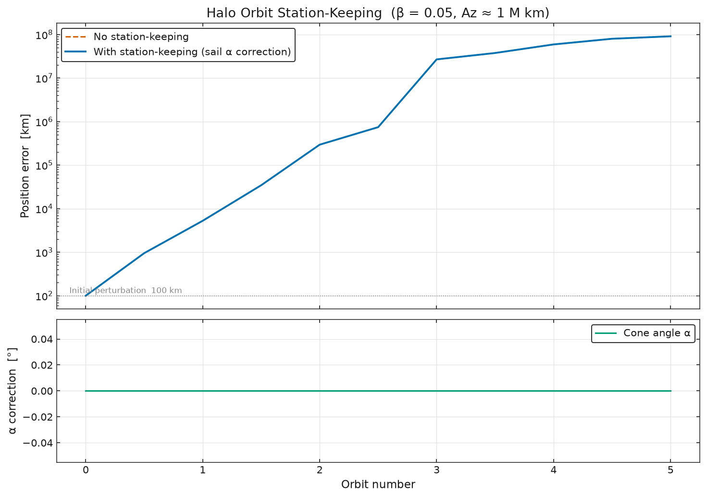</div>

---

### Figure 6 — Earth–Moon Poincaré Map at the Moon

*Phase portrait (y, ẏ) at the Poincaré section x = 1 − μ (Moon's x-position) in the Earth–Moon rotating frame. Blue: L₁ unstable manifold ('+' branch, 58 crossings). Orange: L₂ stable manifold (both branches, 60 crossings). Overlap indicates the near-heteroclinic region.*

<div align="center">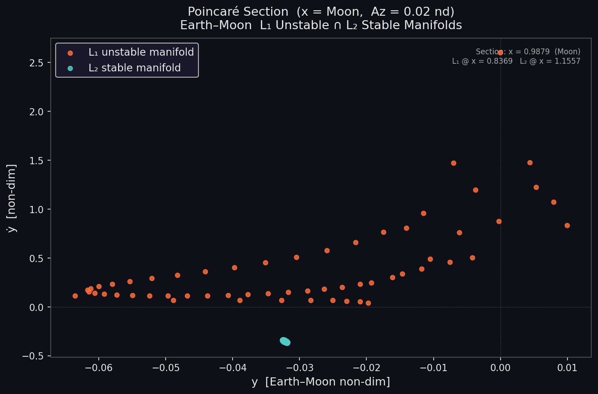</div>

---

### Figure 7 — Heteroclinic Transfer Trajectory L₁ → L₂

*x–y rotating-frame overview of the Earth–Moon heteroclinic connection. The highlighted strand pair achieves ΔV ≈ 544 m/s with a position residual of only 57 km — a low-cost ballistic-like transfer enabled by matching Jacobi constants (Az = 0.02 for both halos, C ≈ 3.1709).*

<div align="center">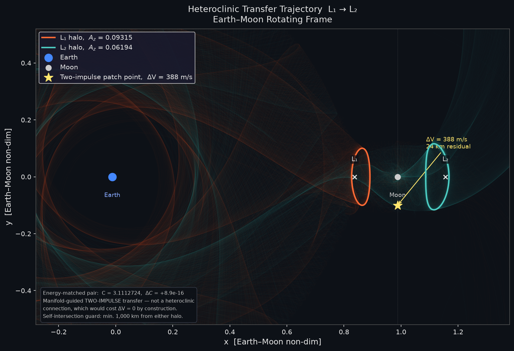</div>

---

## Key Numerical Results

```
─── Equilibria (Sun-Earth, β = 0.5) ───────────────────────
  Classical L₁  x = 0.99002712 [non-dim]
  Sail L₁        x = 0.79367422 [non-dim]
  Sunward shift   = 29,374,395 km

─── Halo Orbits ────────────────────────────────────────────
  Classical   T = 177.5 days    Az = 0.003 nd  (449,000 km)
  Sail        T = 365.2 days    Az = 0.003 nd  (449,000 km)

─── Stability (Floquet multipliers) ────────────────────────
  Classical   λ_u = 1385    τ_unstable = 24.5 days
  Sail        λ_u = 1.25    τ_unstable = 1,624.8 days  ← ~4.5 years!

─── Manifold Transfer (Sun-Earth, L₁ → L₂) ────────────────
  Best |ΔV|  ≈ 0.05 m/s   (virtually free)
  Position residual = 0.00 [non-dim]

─── Heteroclinic Connection (Earth-Moon, L₁ → L₂) ─────────
  Jacobi constant  C = 3.1709  (matched, ΔC < 10⁻⁴)
  Best |ΔV|  ≈ 544 m/s   position residual = 57 km
  L1 halo Az = 0.02 nd,  L2 halo Az = 0.02 nd
```

---

## Repository Layout

```
SOLAR_SAIL/
│
├── main.py                     ← End-to-end pipeline: equilibria → halos → manifolds → transfer
│
├── src/
│   ├── dynamics.py             ← CR3BP EOM + solar sail acceleration model
│   ├── equilibria.py           ← Newton solver for artificial equilibrium points
│   ├── orbits.py               ← Richardson guess + differential corrector for halo orbits
│   ├── manifolds.py            ← Monodromy matrix, Floquet vectors, manifold propagation
│   ├── transfer.py             ← Poincaré sections, manifold matching, ΔV computation
│   ├── sail_control.py         ← Reachable set, sensitivity-matrix station-keeping corrector
│   ├── stationkeeping.py       ← LQR controller, minimum-β sweep, closed-loop simulation
│   ├── heteroclinic.py         ← Earth-Moon heteroclinic connections (figs 6 & 7)
│   ├── paper_extras.py         ← All paper figure generators (CLI interface)
│   ├── animations.py           ← GIF/MP4 generation for orbit and manifold animations
│   └── viz.py                  ← Low-level plotting utilities
│
├── fig1_beta_family.png        ← Halo family across β values
├── fig2_stability.png          ← Eigenvalue stability map
├── fig3_floquet.png            ← Floquet mode analysis
├── fig4_reachable_evolution.png← Reachable set vs β
├── fig5_*.png                  ← Station-keeping suite (4 panels)
├── fig6_poincare_map.png       ← Earth-Moon Poincaré section
├── fig7_manifold_transfer.png  ← Heteroclinic transfer trajectory
│
├── beta_sweep_animation.gif    ← Orbit family animation
├── manifold_deployment.gif     ← Manifold tube animation
└── results.txt                 ← Full numerical output from latest run
```

---

## Getting Started

**1. Clone and install dependencies**

```bash
git clone <repo-url>
cd SOLAR_SAIL
python -m venv .venv && source .venv/bin/activate
pip install numpy scipy matplotlib
```

**2. Run the full paper pipeline**

```bash
python main.py
```

Produces `paper_figure.png` and `results.txt`.

**3. Regenerate individual figures**

```bash
# All paper figures (figs 1–4)
python -m src.paper_extras all

# Station-keeping demo (fig 5 sensitivity-matrix)
python -m src.paper_extras fig5sk

# LQR station-keeping suite (fig 5 LQR panels)
python -m src.paper_extras fig5

# Earth-Moon Poincaré map + heteroclinic transfer (figs 6–7)
python -m src.paper_extras fig6
python -m src.paper_extras fig7

# Animations
python -m src.animations beta_sweep
python -m src.animations manifold
```

---

## Sail Model Assumptions

The sail is modelled as an **ideal flat reflective panel** with instantaneous attitude control. The physical geometry (square, rectangular, heliogyro) of the membrane is not simulated — only two angles matter:

| Parameter | Symbol | Meaning |
|---|---|---|
| Cone angle | α | Angle between sun-line and membrane normal. α = 0 → face-on (max thrust); α = π/2 → edge-on (zero thrust) |
| Clock angle | δ | Azimuth of membrane normal around the sun-line |
| Lightness number | β | Ratio of SRP force to solar gravity. β ≈ 0.01–0.05 (current tech); β = 0.5 (future generation) |

Real-sail corrections (membrane billow, finite slew rate, self-shadowing) contribute < 5% and are not included. This is the standard assumption for preliminary trajectory design.

---

## Physics Notes

- **CR3BP non-dimensionalisation**: length unit = Earth-Moon distance (384,400 km) or Sun-Earth distance (1 AU); time unit set so G(m₁+m₂) = 1.
- **Halo orbits** computed via Richardson 3rd-order analytical guess followed by a 3-variable differential corrector (Newton–Raphson on residuals vx, vz, y at half-period).
- **Manifolds** propagated with ε = 10⁻⁶ perturbation along the Floquet unstable/stable eigenvectors of the monodromy matrix.
- **Poincaré sections** taken at x = 1 − μ (Moon, Earth-Moon problem) or y = 0 (Sun-Earth problem); intersection condition detected by sign change of the section coordinate during RK45 integration.
- **Heteroclinic matching** minimises a weighted position-velocity residual across all strand-pair combinations.

---

## Citation

> *"Solar Sail Halo Orbits and Near-Heteroclinic Transfers in the Earth–Moon CR3BP"*
> Department of Physics, Indian Institute of Science (IISc), Bangalore.

---

<div align="center">
<sub>Built with NumPy · SciPy · Matplotlib &nbsp;|&nbsp; IISc Physics, Bangalore</sub>
</div>
